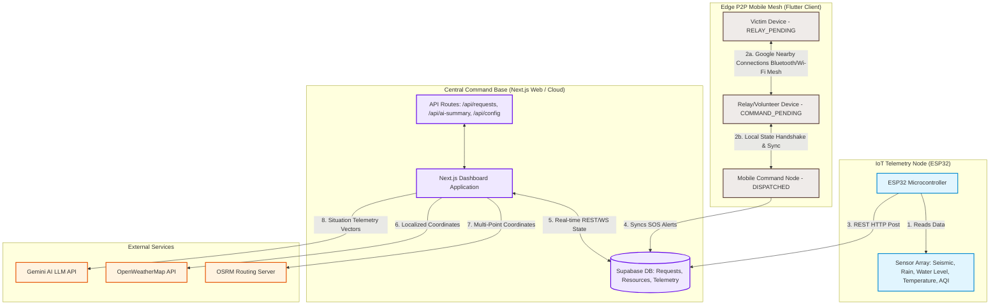
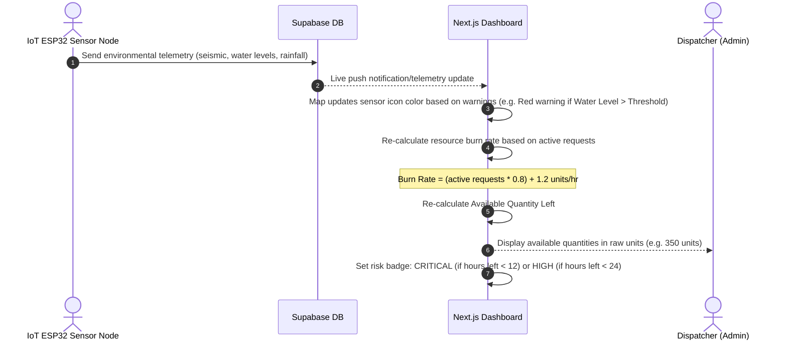
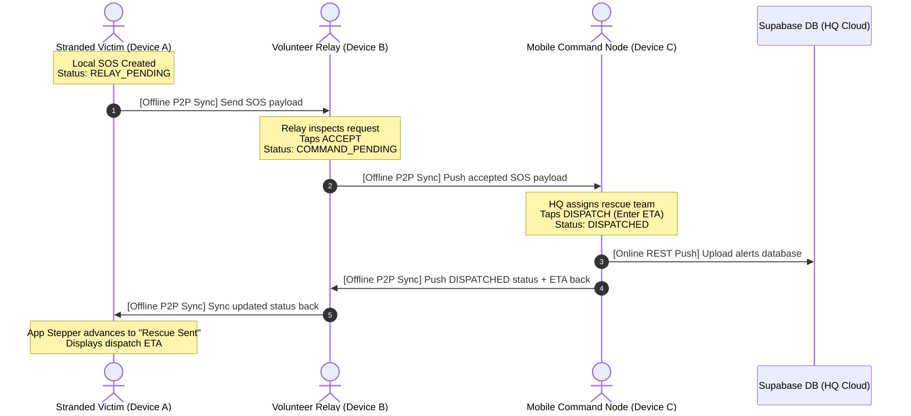
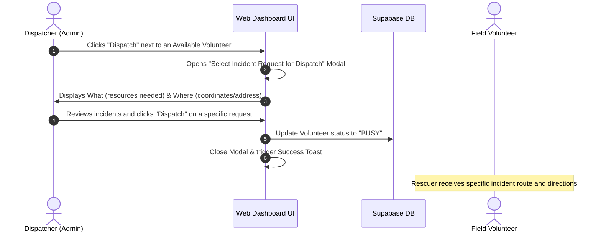
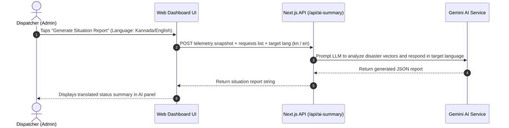

# ResQLink: System Architecture & Workflow Guide

ResQLink is an offline-first disaster response and coordination network. It bridges the gap between stranded victims, field rescuers, and central emergency command bases using a three-tier architecture: IoT hardware sensor nodes, an offline-ready mobile mesh client, and an AI-driven web command dashboard.

---

## 🗺️ 1. High-Level System Architecture

The diagram below outlines the interactions between the **Hardware Tier** (telemetry monitoring), the **Edge Mobile Mesh Network** (offline victim/rescuer sync), and the **Central Command Tier** (Next.js Dashboard + Supabase).

---

## 🛰️ 2. Tier Breakdown & Components

### A. Telemetry Hardware Layer (ESP32)
Deployed at critical topographical regions (rivers, slopes, landslide zones).
* **Controller**: ESP32 Microcontroller with built-in Wi-Fi/Bluetooth stack.
* **Peripherals & Sensors**:
  * **Rainfall Gauge & Water Level Sensor**: Detects flash flooding.
  * **Seismic Sensor**: Detects landslides and structural failures.
  * **DHT22 & Gas Sensor**: Monitors heatwaves, humidity, and wildfire gas concentrations.
* **Intake Logic**: Collects sensor readings, builds a JSON packet, injects auth tokens, and performs an HTTP POST request to the Supabase REST endpoint.

### B. Mobile Mesh Layer (Flutter App)
An offline-first ad-hoc communication client designed for regions with complete grid collapse.
* **Google Nearby Connections**: Handles peer discovery, connection handshakes, and packet transfers via peer-to-peer Bluetooth and Wi-Fi Direct interfaces.
* **Hive Local DB**: Lightweight, high-performance Key-Value storage that retains local SOS reports and status tables when offline.
* **Device Roles**:
  1. **Victim**: Submits panic requests (what supplies are needed, affected headcount, GPS position).
  2. **Relay**: Volunteers who physically travel. They act as "data mules," gathering SOS logs from victims and transferring them to command.
  3. **Command**: Localized command posts that coordinate rescues.

### C. Web Dashboard Layer (Next.js)
The brain of the rescue operations.
* **Leaflet Maps & OSRM**: Visualizes incident sites, live sensor locations, and overlays routing lines for rescuers.
* **Machine Learning & Forecasting**: Predicts resource burn rates and exhaustion thresholds (alerting dispatchers when critical items like medical kits or boats are nearing zero).
* **AI Summary Generator**: Aggregates all sensor data and requests, translating them into compiled emergency summaries.
* **Dynamic Translation Engine**: Translates all titles, forecasts, and AI summaries on the fly into Kannada (`kn`) and English (`en`).

---

## 🔄 3. Core Operational Workflows

### 3.1. Telemetry Pipeline & Forecasting Workflow
Monitors environmental vitals and predicts resource runtimes.

---

### 3.2. Offline Mobile Mesh Sync Protocol
Propagates SOS requests and resolution feedback between stranded victims and central HQ.

---

### 3.3. Incident Allocation & Volunteer Dispatch
Enables dispatchers to assign on-duty volunteers to specific active incidents.

---

### 3.4. Multi-Language AI Summarization Workflow
Translates real-time telemetry into compiled situational logs.

