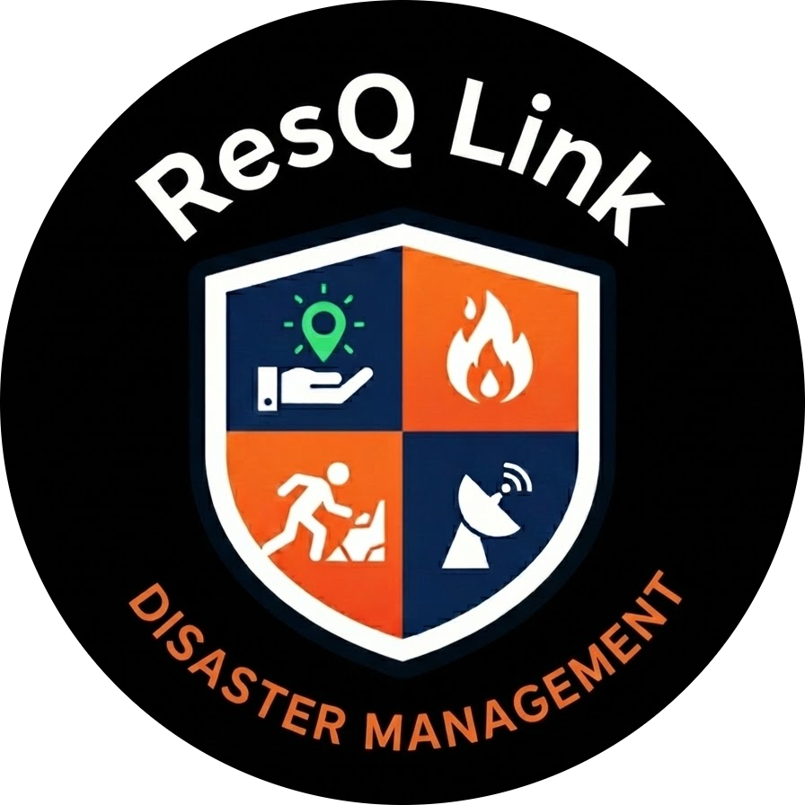
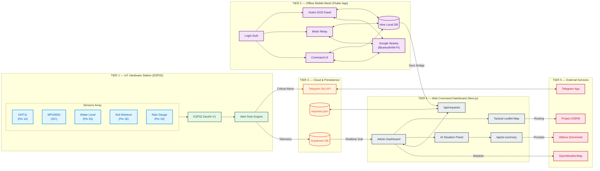
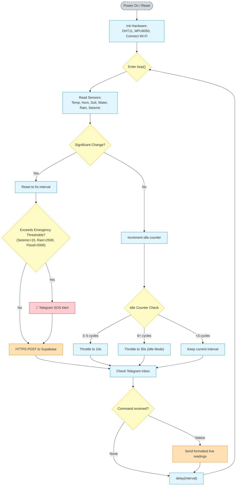
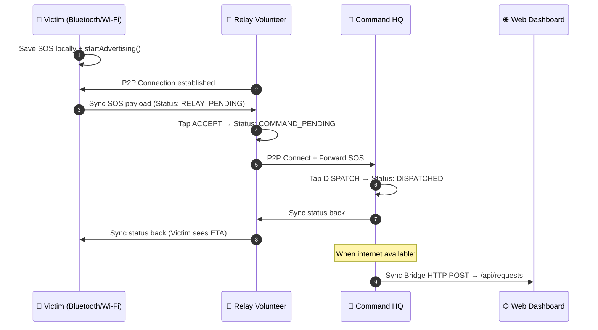
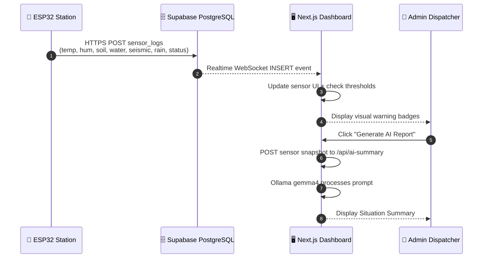

#  📡 ResQLink — Complete System Architecture & Workflow Document

> **Last Updated**: May 2026 | **Version**: 4.1
> A unified, beautifully elaborated reference covering every module, technology, protocol, and data pipeline in the ResQLink disaster response platform.

---

## 🗺️ 1. Full-Stack Unified Architecture



---

## 🛠️ 2. Complete Technology Stack

### Tier 1 — IoT Hardware (ESP32 Firmware)

| Component | Sensor / Module | Library | Data Output |
|:---|:---|:---|:---|
| MCU Board | ESP32 DevKit V1 | Arduino Core + WiFi.h | IP, MAC, RSSI |
| Temperature & Humidity | DHT11 (Pin 14) | `DHT.h` (Adafruit) | °C, % |
| Seismic / Vibration | MPU6050 (I2C) | `Adafruit_MPU6050.h` | 3-axis vector magnitude (m/s²) |
| Water Level | Analog (Pin 25) | `analogRead()` | 0–4095 ADC |
| Soil Moisture | Analog (Pin 26) | `analogRead()` | 0–4095 ADC |
| Rainfall Intensity | Rain Gauge (Pin 33) | `analogRead()` inverted | 0–4095 |
| Alert Messaging | Telegram Bot | `UniversalTelegramBot.h` | SOS push + /status commands |
| Database Sync | Supabase REST | `HTTPClient.h` + `ArduinoJson.h` | HTTPS POST JSON |
| Secure Transport | TLS/SSL | `WiFiClientSecure.h` | Encrypted HTTPS |

### Tier 2 — Offline Mobile App (Flutter)

| Component | Package | Purpose |
|:---|:---|:---|
| Framework | Flutter SDK 3.x | Cross-platform Android native build |
| P2P Mesh Network | `nearby_connections: 4.3.0` | Google Nearby Connections — Bluetooth + Wi-Fi Direct ad-hoc mesh |
| Offline Database | `hive: 2.2.3` + `hive_flutter: 1.1.0` | Local key-value NoSQL cache for SOS state persistence |
| GPS Location | `geolocator: 11.0.0` | Native GPS coordinate detection on victim devices |
| Mapping | `flutter_map: 6.1.0` + `latlong2: 0.9.0` | OpenStreetMap tile rendering with SOS markers |
| HTTP Client | `http: 1.2.0` | Sync Bridge — POST mesh data to web dashboard API |
| Unique IDs | `uuid: 4.3.3` | Generate unique SOS distress signal identifiers |

**Android Permissions** (AndroidManifest.xml):
- `BLUETOOTH`, `BLUETOOTH_ADMIN`, `BLUETOOTH_SCAN`, `BLUETOOTH_ADVERTISE`, `BLUETOOTH_CONNECT`
- `ACCESS_FINE_LOCATION`, `ACCESS_COARSE_LOCATION`
- `CHANGE_WIFI_STATE`, `ACCESS_WIFI_STATE`, `NEARBY_WIFI_DEVICES`, `INTERNET`

### Tier 3 & 4 — Cloud, Web Command (Next.js) & Persistence

| Feature | Technology | Description |
|:---|:---|:---|
| Framework | Next.js 16.2.6 (Turbopack) | React 19.2, Server-Side Rendering, API Routes |
| Map Engine | Leaflet.js 1.9.4 | Interactive tactical map with markers, polylines, popups |
| Map Themes | OpenStreetMap + CARTO Dark | Normal mode + Tactical (dark) mode toggle |
| AI Assistant | Ollama (localhost:11434) | Local Gemma4 LLM situation report generation |
| Database | Supabase (PostgreSQL) | Realtime `sensor_logs` tracking hardware telemetry |
| Mesh Sync DB| `requests.json` | Local file DB deduplicating mobile mesh SyncBridge posts |
| ML Priority | Custom scoring matrix | Resource-type × severity × affected-count = priority class |
| Translations | React state TRANSLATIONS | Full UI bilingual toggle: English ↔ Kannada |
| SOS Panic | Browser Geolocation API | One-tap GPS + Telegram alert broadcast to emergency team |
| Dispatch | Interactive modal | Select volunteer → view all active requests → assign |

### Tier 5 — External Services

| Service | Endpoint | Usage |
|:---|:---|:---|
| Ollama (Local) | `http://localhost:11434/api/generate` | Gemma4 9.6GB local LLM — AI situation summaries |
| OpenWeatherMap | `api.openweathermap.org/data/2.5/weather` | Weather conditions by lat/lng + language param |
| Project OSRM | `router.project-osrm.org/route/v1/driving/` | Multi-point driving route with GeoJSON geometry |
| Telegram Bot | `api.telegram.org/bot{token}/sendMessage` | Emergency SOS alert push + interactive /status commands |

---

## 🔄 3. Detailed Workflow Diagrams

### 3.1. ESP32 Firmware Execution Loop



---

### 3.2. Offline Mesh Network Protocol (Mobile)



---

### 3.3. Supabase Realtime Telemetry Pipeline (Hardware → Web)



---

## 📊 4. Data Models

### ESP32 → Supabase Payload
```json
{
  "temperature": 24.5,
  "humidity": 62.0,
  "soil_moisture": 2100,
  "water_level": 120.0,
  "seismic": 0.05,
  "rain_level": 0,
  "status": "Updated"
}
```

### Alert Thresholds (ESP32 Rule Engine)
| Condition | Sensor | Threshold | Alert Status |
|:---|:---|:---|:---|
| Earthquake | MPU6050 | Seismic vector > 15 m/s² | `Earthquake Alert` |
| Heavy Rainfall | Rain Gauge | Rain > 2500 | `Heavy Rain Alert` |
| Flood | Water Level | Water level > 2000 | `Flood Alert` |
| Drought | DHT11 + Soil | Temp > 45°C AND Soil > 3800 | `Drought` |
