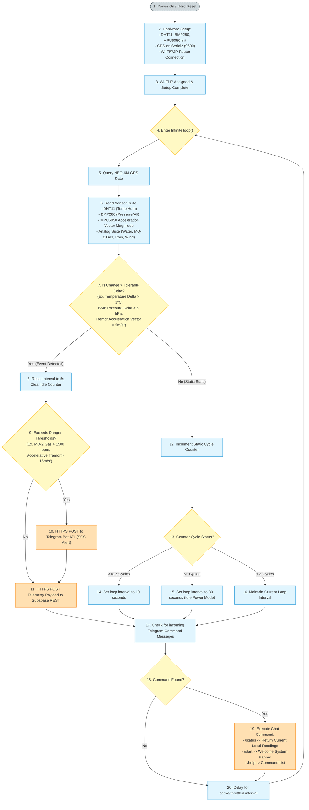
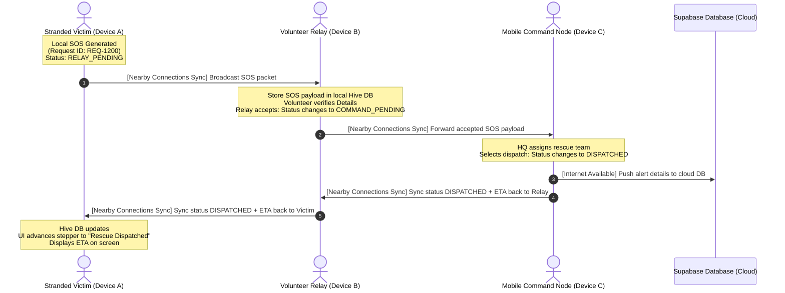
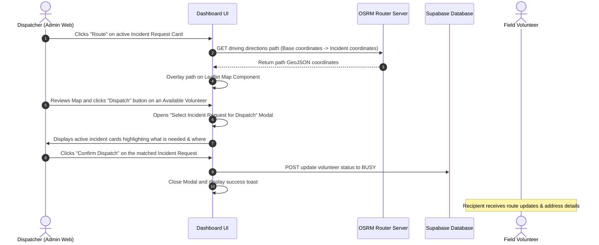
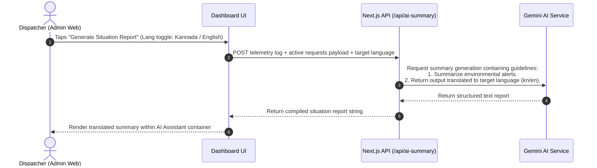

# 📡 ResQLink: Complete Unified System Architecture & Workflow Guide

ResQLink is a comprehensive, offline-first disaster telemetry, coordination, and response network. The platform bridges the gap between IoT hardware sensors, mobile field responders, and central headquarters during extreme environmental events and grid collapses.

---

## 🗺️ 1. Unified System Architecture Chart

The flowchart below represents the full end-to-end architecture of ResQLink, highlighting the four core subsystems: **IoT Telemetry Hardware**, **Offline Mobile Mesh Network**, **Cloud Backend Database**, and the **Next.js Web Command Dashboard**.

```mermaid
graph TD
    %% Styling Definitions
    classDef sensor fill:#e1f5fe,stroke:#0288d1,stroke-width:2px;
    classDef mcu fill:#e8f5e9,stroke:#2e7d32,stroke-width:2px;
    classDef mobile fill:#f3e5f5,stroke:#7b1fa2,stroke-width:2px;
    classDef cloud fill:#fff3e0,stroke:#e65100,stroke-width:2px;
    classDef client fill:#eceff1,stroke:#455a64,stroke-width:2px;
    classDef ext fill:#ffe0b2,stroke:#f57c00,stroke-width:2px;

    %% ----------------------------------------------------
    %% IoT TELEMETRY HARDWARE SUITE
    %% ----------------------------------------------------
    subgraph Hardware ["1. IoT Telemetry Layer (ESP32 Deployed Station)"]
        subgraph Sensors ["Sensor Suite Array"]
            DHT11[DHT11 Temperature & Humidity]:::sensor
            MPU6050[MPU6050 Accelerometer - Seismic Activity]:::sensor
            BMP280[BMP280 Barometer - Altitude & Storm Warning]:::sensor
            GPS_Node[NEO-6M GPS Module - Station Coordinates]:::sensor
            AnalogSensors["Analog Array: Water level, Soil moisture, MQ-2 Gas, Rain, Wind speed / direction"]:::sensor
        end

        subgraph MCU ["MCU Processing & Execution"]
            ESP32[ESP32 DevKit V1 Main Board]:::mcu
            EnergyLoop["Adaptive Throttling Loop<br/>(Active: 5s | Moderate: 10s | Idle: 30s)"]:::mcu
            AlertEngine[Alert Rule Check Engine]:::mcu
        end

        Sensors <-->|Analog, I2C, Serial, SPI| ESP32
        ESP32 -->|Runs Loop| EnergyLoop
        EnergyLoop -->|Evaluates Tolerances| AlertEngine
    end

    %% ----------------------------------------------------
    %% OFFLINE MOBILE MESH NETWORK (FLUTTER CLIENT)
    %% ----------------------------------------------------
    subgraph MobileMesh ["2. Edge Mobile Mesh Layer (resqlink_mobile Flutter)"]
        VictimPhone["Victim Node (Device A)<br/>- SOS Creator<br/>- Local Hive DB<br/>- RELAY_PENDING"]:::mobile
        RelayPhone["Relay Node (Device B)<br/>- Rescuer/Volunteer Router<br/>- Local Hive DB<br/>- COMMAND_PENDING"]:::mobile
        HQMobile["Command Node (Device C)<br/>- Field HQ Base<br/>- Local Hive DB<br/>- DISPATCHED + ETA"]:::mobile

        VictimPhone <-->|Google Nearby Connections<br/>P2P Bluetooth / Wi-Fi Direct Mesh| RelayPhone
        RelayPhone <-->|State Reconciliation<br/>(lastUpdated timestamp comparison)| HQMobile
    end

    %% ----------------------------------------------------
    %% CLOUD & STATE PERSISTENCE LAYER
    %% ----------------------------------------------------
    subgraph CloudLayer ["3. Cloud & Network Layer"]
        Supabase[(Supabase PostgreSQL Database)]:::cloud
        SupaAPI["Supabase REST API Endpoints"]:::cloud
        TeleAPI[Telegram Bot API Server]:::cloud

        Supabase <--> SupaAPI
    end

    %% ----------------------------------------------------
    %% PRESENTATION & COORDINATION LAYER
    %% ----------------------------------------------------
    subgraph Dashboard ["4. Web Command Center (Next.js Dashboard)"]
        NextUI["Next.js Web Client UI<br/>(Glassmorphism & Responsive Grid)"]:::client
        LocaleEngine["Bilingual Translation Subsystem<br/>(Kannada / English Toggle)"]:::client
        MapBox["Interactive Leaflet Map Component<br/>(Live GPS tracking & interactive routes)"]:::client
        Forecasting["Inventory Run-Rate Forecasting Model<br/>(Resource tracking & dynamic risk status)"]:::client
        AISummary["AI Summary Engine<br/>(Calls /api/ai-summary backend)"]:::client
    end

    %% ----------------------------------------------------
    %% EXTERNAL INTERFACES
    %% ----------------------------------------------------
    subgraph External ["5. Third-Party Integrations"]
        Gemini[Gemini AI LLM Service]:::ext
        OpenWeather[OpenWeatherMap API]:::ext
        OSRM[OSRM Driving Route Server]:::ext
        TeleApp[Telegram App Client Messenger]:::ext
    end

    %% ----------------------------------------------------
    %% PIPELINE CONNECTIONS & INTER-LAYER FLOW
    %% ----------------------------------------------------
    %% ESP32 Data Uploads
    AlertEngine -->|A1. Critical Emergency Event| TeleAPI
    ESP32 -->|A2. HTTPS POST Telemetry| SupaAPI

    %% Telegram Interaction
    TeleAPI <-->|Message Routing| TeleApp
    TeleApp <-->|User /status & /start Commands| ESP32

    %% Mobile Mesh Uploads
    HQMobile -->|B1. HTTPS POST Mesh SOS Data| SupaAPI

    %% Next.js Database Interactions
    SupaAPI <-->|C1. Real-time REST Sync / WebSockets| NextUI

    %% Next.js Subsystem Integration
    NextUI <--> LocaleEngine
    NextUI <--> MapBox
    NextUI <--> Forecasting
    NextUI <--> AISummary

    %% Next.js External Connectors
    MapBox -->|D1. Multi-Point GeoJSON Route Request| OSRM
    NextUI -->|D2. Current Lat/Lng Coordinate Lookup| OpenWeather
    AISummary -->|D3. Contextual Telemetry Payload| Gemini
```

---

## 🔄 2. Complete End-to-End System Workflows

### 2.1. Telemetry Loop & Adaptive Energy Flow (ESP32 Firmware)
How the hardware node optimizes power consumption and pushes warnings to first responders.



---

### 2.2. Offline Peer-to-Peer Mesh Sync Protocol (Mobile Client)
How stranded victims send messages out of disaster zones through relay volunteers.



---

### 2.3. Web Allocation and Selective Volunteer Dispatch
How dispatchers visually map incidents, calculate paths, and assign available help.



---

### 2.4. Localized AI Telemetry Summarization
The flow for compiling telemetry readings and generating translated reports.



---

## 🛠️ 3. Technologies & Library Matrix

| Tier | Component / Technology | Package / Library | Role & Utility |
| :--- | :--- | :--- | :--- |
| **Hardware** | ESP32 Board Core | `esp32` core libraries | Central processing, I/O pin management |
| **Hardware** | Temperature/Hum | `DHT.h` (Adafruit) | Atmospheric thermal measurements |
| **Hardware** | Seismic Sensor | `Adafruit_MPU6050.h` | Analyzes seismic shaking and tremors |
| **Hardware** | Barometer | `Adafruit_BMP280.h` | Atmospheric pressure & local elevation |
| **Hardware** | GPS Tracking | `TinyGPS++.h` | Resolves lat/lng and lock timestamps |
| **Hardware** | Database Sync | `HTTPClient.h` | Transmits secure HTTPS POST data to Supabase |
| **Hardware** | Telegram Messenger | `UniversalTelegramBot.h` | Delivers instant SOS text logs to first responders |
| **Mobile** | Cross-Platform App | Flutter Framework | Native builds for Android field devices |
| **Mobile** | P2P Connections | `nearby_connections` | Off-grid ad-hoc mesh communication via Wi-Fi/Bluetooth |
| **Mobile** | Local Cache DB | `hive_flutter` | High-performance offline storage for alert states |
| **Backend** | Cloud Database | Supabase (PostgreSQL) | Dynamic persistence for telemetry logs, requests, and volunteers |
| **Web UI** | Web Framework | Next.js 16.2 (Turbopack) | Dynamic server-side rendering, API routes, and components |
| **Web UI** | Geolocation Map | Leaflet.js | Dynamic overlays for stations, victims, and routes |
| **Web UI** | Navigation | Project OSRM API | Calculates real-time distance and time route coordinates |
| **Web UI** | Translations | Dynamic React state map | Context translations for English and Kannada UI |
| **Web UI** | AI Copilot | Gemini API / SDK | Automated situation reports based on incident vectors |
