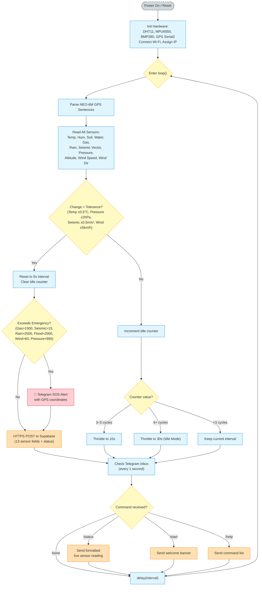
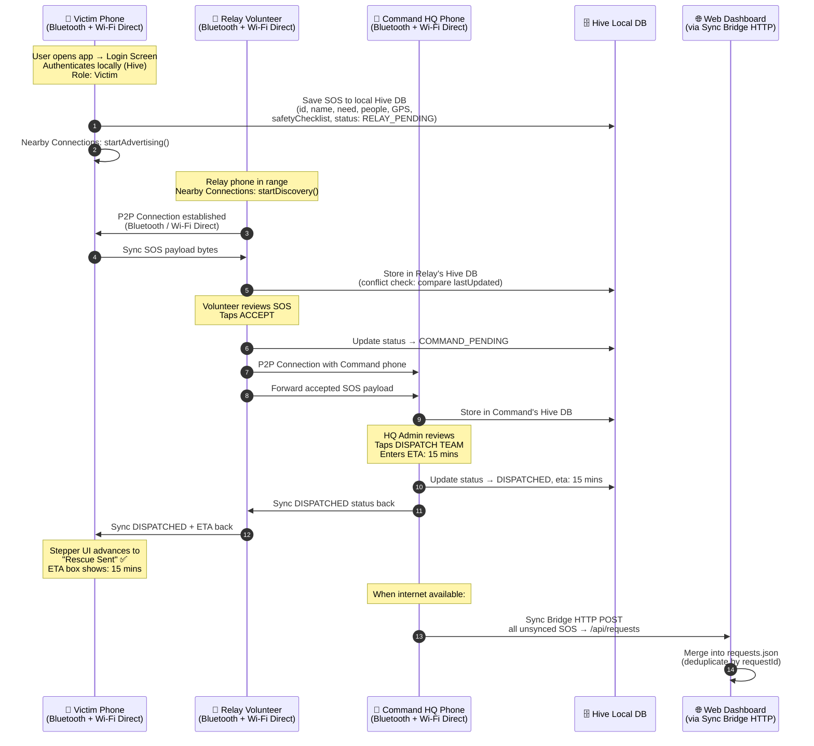
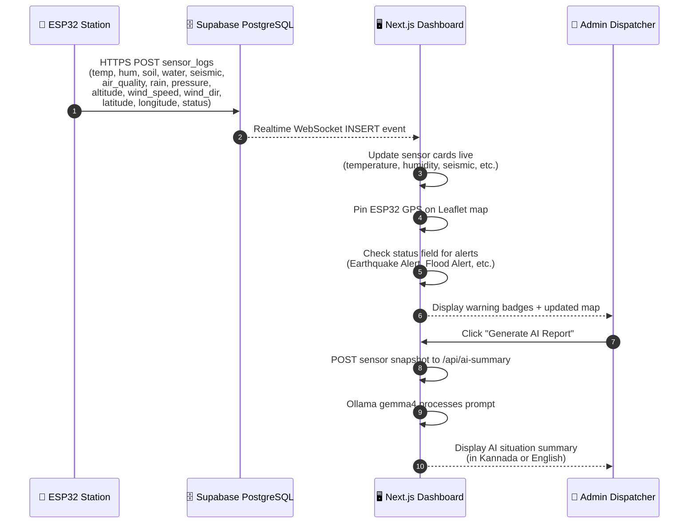
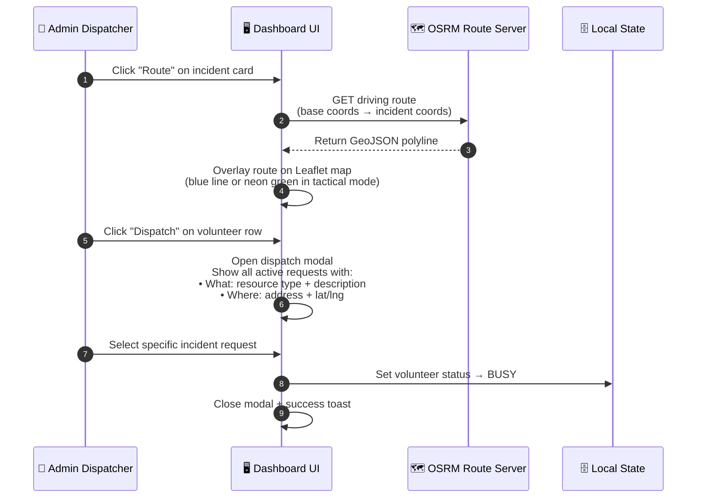
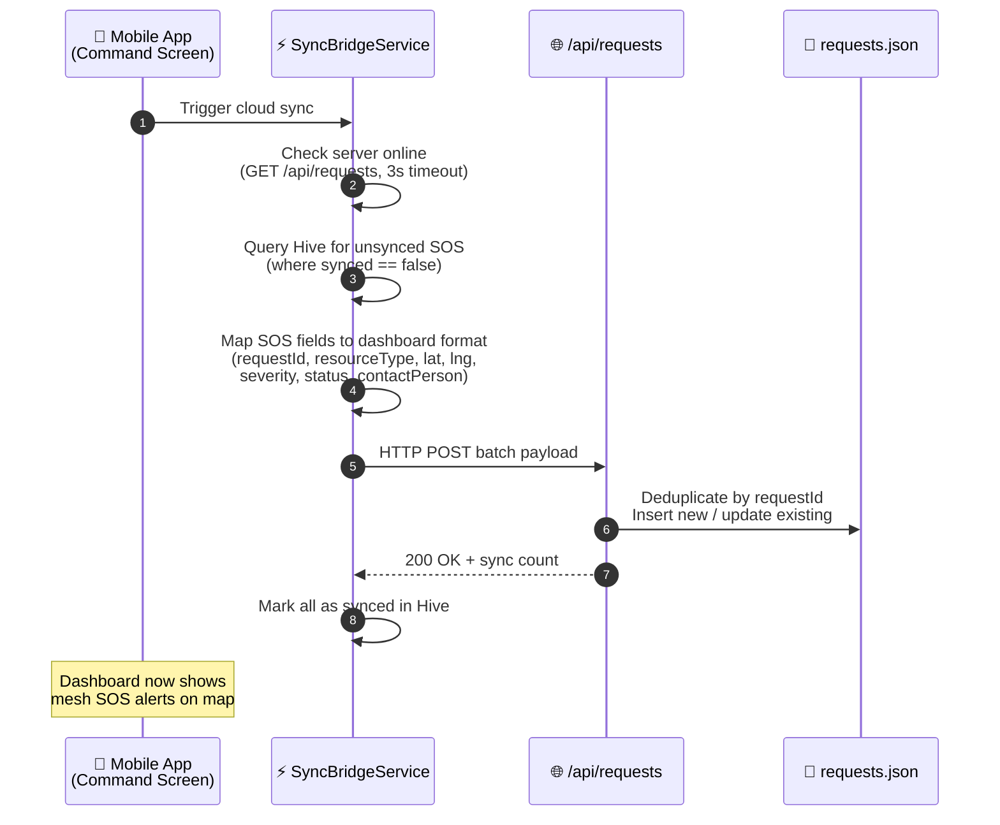
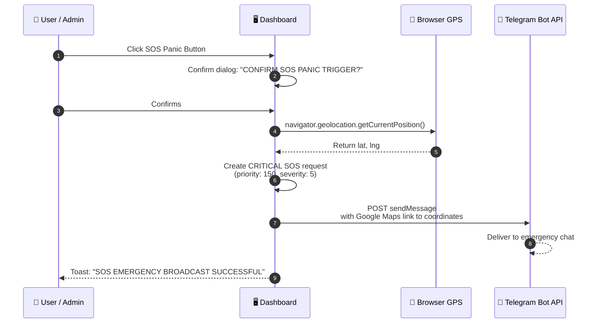

# 📡 ResQLink — Complete System Architecture & Workflow Document

> **Last Updated**: May 2026 | **Version**: 4.0  
> A unified reference covering every module, technology, protocol, and data pipeline in the ResQLink disaster response platform.

---

## 🗺️ 1. Full-Stack Unified Architecture

```mermaid
graph TD
    classDef hw fill:#e1f5fe,stroke:#0288d1,stroke-width:2px
    classDef fw fill:#e8f5e9,stroke:#2e7d32,stroke-width:2px
    classDef mob fill:#f3e5f5,stroke:#7b1fa2,stroke-width:2px
    classDef db fill:#fff3e0,stroke:#e65100,stroke-width:2px
    classDef web fill:#eceff1,stroke:#455a64,stroke-width:2px
    classDef ext fill:#fce4ec,stroke:#c62828,stroke-width:2px

    subgraph HW ["TIER 1 — IoT Hardware Station (ESP32)"]
        DHT11["DHT11<br/>Temperature & Humidity"]:::hw
        MPU6050["MPU6050 Accelerometer<br/>Seismic Tremor Detection"]:::hw
        BMP280["BMP280 Barometer<br/>Pressure & Altitude"]:::hw
        GPS["NEO-6M GPS Module<br/>Live Lat/Lng Coordinates"]:::hw
        WATER["Water Level Sensor<br/>(Analog Pin 34)"]:::hw
        SOIL["Soil Moisture Sensor<br/>(Analog Pin 35)"]:::hw
        MQ2["MQ-2 Gas/Smoke Sensor<br/>(Analog Pin 32)"]:::hw
        RAIN["Rain Gauge Sensor<br/>(Analog Pin 33)"]:::hw
        WIND_S["Anemometer<br/>Wind Speed (Analog Pin 36)"]:::hw
        WIND_D["Wind Vane<br/>Direction (Analog Pin 39)"]:::hw
        ESP32["ESP32 DevKit V1<br/>Main MCU Board"]:::fw
        THROTTLE["Adaptive Energy Throttle<br/>5s / 10s / 30s polling"]:::fw
        ALERT_ENGINE["Alert Rule Engine<br/>Threshold Evaluator"]:::fw
    end

    subgraph MOBILE ["TIER 2 — Offline Mobile Mesh (Flutter App)"]
        LOGIN_M["Login Screen<br/>User / Admin Auth<br/>(Hive localStorage)"]:::mob
        VICTIM["Victim Screen<br/>SOS Generator + GPS Detect<br/>(geolocator plugin)"]:::mob
        RELAY["Relay Screen<br/>Accept / Reject / Escalate"]:::mob
        COMMAND_M["Command Screen<br/>Dispatch + ETA assignment"]:::mob
        MAP_M["Tactical Mesh Map<br/>(flutter_map + OpenStreetMap)"]:::mob
        HIVE["Hive Local DB<br/>Offline SOS State Cache"]:::mob
        NEARBY["Google Nearby Connections<br/>Bluetooth + Wi-Fi Direct P2P"]:::mob
        SYNC_BRIDGE["Sync Bridge Service<br/>HTTP POST to Web Dashboard"]:::mob
    end

    subgraph CLOUD ["TIER 3 — Cloud & Persistence"]
        SUPA_DB[("Supabase PostgreSQL<br/>sensor_logs table")]:::db
        SUPA_API["Supabase REST API<br/>+ Realtime WebSocket Channel"]:::db
        JSON_DB[("Local JSON File<br/>src/data/requests.json")]:::db
        TELE_API["Telegram Bot API<br/>Server"]:::db
    end

    subgraph WEB ["TIER 4 — Web Command Dashboard (Next.js 16)"]
        LOGIN_W["Login / Register UI<br/>(localStorage session)"]:::web
        DASH["Admin Dashboard<br/>Glassmorphism UI + CSS Grid"]:::web
        MAP_W["Leaflet.js Interactive Map<br/>+ Tactical Dark Mode Toggle"]:::web
        FORECAST["Inventory Forecasting Engine<br/>Burn Rate + Risk Status"]:::web
        ML_SCORE["ML Priority Scoring<br/>Resource-Severity Matrix"]:::web
        AI_PANEL["AI Situation Report Panel<br/>(Ollama + Gemma4 Local LLM)"]:::web
        LOCALE["Bilingual Engine<br/>Kannada / English Dynamic Toggle"]:::web
        SOS_BTN["SOS Panic Button<br/>GPS + Telegram Instant Alert"]:::web
        DISPATCH_MODAL["Volunteer Dispatch Modal<br/>Select Request -> Assign"]:::web
        API_REQ["API: /api/requests<br/>GET + POST (Sync Bridge)"]:::web
        API_AI["API: /api/ai-summary<br/>POST (Ollama proxy)"]:::web
        API_CFG["API: /api/config<br/>GET (Supabase keys)"]:::web
    end

    subgraph EXT ["TIER 5 — External Services"]
        OLLAMA["Ollama Local Server<br/>gemma4:latest (9.6 GB)"]:::ext
        OWM["OpenWeatherMap API<br/>Weather by Coordinates"]:::ext
        OSRM["Project OSRM<br/>Driving Route GeoJSON"]:::ext
        TELE_APP["Telegram Messenger App<br/>End-User SOS Alerts"]:::ext
    end

    %% Hardware Internal
    DHT11 & MPU6050 & BMP280 & GPS & WATER & SOIL & MQ2 & RAIN & WIND_S & WIND_D -->|I2C / Analog / Serial| ESP32
    ESP32 --> THROTTLE --> ALERT_ENGINE

    %% Hardware -> Cloud
    ESP32 -->|HTTPS POST JSON payload| SUPA_API
    ALERT_ENGINE -->|Critical SOS Message| TELE_API

    %% Telegram loop
    TELE_API <-->|Message Routing| TELE_APP
    TELE_APP -->|/status /start /help| ESP32

    %% Mobile Internal
    LOGIN_M --> VICTIM & RELAY & COMMAND_M & MAP_M
    VICTIM & RELAY & COMMAND_M <--> HIVE
    VICTIM & RELAY & COMMAND_M <-->|P2P Data Sync| NEARBY
    VICTIM -->|Geolocator GPS Detect| GPS

    %% Mobile -> Cloud
    SYNC_BRIDGE -->|HTTP POST SOS payloads| API_REQ
    HIVE --> SYNC_BRIDGE

    %% Cloud Internal
    SUPA_DB <--> SUPA_API

    %% Web Internal
    LOGIN_W --> DASH
    DASH --> MAP_W & FORECAST & ML_SCORE & AI_PANEL & LOCALE & SOS_BTN & DISPATCH_MODAL

    %% Web -> Cloud
    DASH <-->|Realtime subscribe sensor_logs| SUPA_API
    API_REQ <--> JSON_DB

    %% Web -> External
    AI_PANEL --> API_AI -->|POST prompt| OLLAMA
    MAP_W -->|Route request| OSRM
    DASH -->|Weather by lat/lng + lang| OWM
    SOS_BTN -->|Telegram sendMessage| TELE_API
```



---

## 🛠️ 2. Complete Technology Stack

### Tier 1 — IoT Hardware (ESP32 Firmware)

| Component | Sensor / Module | Library | Data Output |
|:---|:---|:---|:---|
| MCU Board | ESP32 DevKit V1 | Arduino Core + WiFi.h | IP, MAC, RSSI |
| Temperature & Humidity | DHT11 (Pin 14) | `DHT.h` (Adafruit) | °C, % |
| Seismic / Vibration | MPU6050 (I2C) | `Adafruit_MPU6050.h` | 3-axis vector magnitude (m/s²) |
| Barometric Pressure | BMP280 (I2C, 0x76) | `Adafruit_BMP280.h` | hPa, meters altitude |
| GPS Tracking | NEO-6M (Serial2, 9600 baud) | `TinyGPS++.h` | Latitude, Longitude |
| Water Level | Analog (Pin 34) | `analogRead()` | 0–4095 ADC |
| Soil Moisture | Analog (Pin 35) | `analogRead()` | 0–4095 ADC |
| Gas / Smoke Detection | MQ-2 (Pin 32) | `analogRead()` | 0–4095 ppm equivalent |
| Rainfall Intensity | Rain Gauge (Pin 33) | `analogRead()` inverted | 0–4095 |
| Wind Speed | Anemometer (Pin 36) | `analogRead()` → 0–120 km/h | km/h |
| Wind Direction | Wind Vane (Pin 39) | `analogRead()` → 0–360° | Degrees |
| Alert Messaging | Telegram Bot | `UniversalTelegramBot.h` | SOS push + /status commands |
| Database Sync | Supabase REST | `HTTPClient.h` + `ArduinoJson.h` | HTTPS POST JSON |
| Secure Transport | TLS/SSL | `WiFiClientSecure.h` | Encrypted HTTPS |

### Tier 2 — Offline Mobile App (Flutter)

| Component | Package | Purpose |
|:---|:---|:---|
| Framework | Flutter SDK 3.x | Cross-platform Android native build |
| P2P Mesh Network | `nearby_connections: 4.3.0` | Google Nearby Connections — Bluetooth + Wi-Fi Direct ad-hoc mesh |
| Offline Database | `hive: 2.2.3` + `hive_flutter: 1.1.0` | Local key-value NoSQL cache for SOS state persistence |
| GPS Location | `geolocator: 11.0.0` | Native GPS coordinate detection on victim devices |
| Mapping | `flutter_map: 6.1.0` + `latlong2: 0.9.0` | OpenStreetMap tile rendering with SOS markers |
| HTTP Client | `http: 1.2.0` | Sync Bridge — POST mesh data to web dashboard API |
| Unique IDs | `uuid: 4.3.3` | Generate unique SOS distress signal identifiers |
| Date Formatting | `intl: 0.19.0` | Timestamp localization |
| Permissions | `permission_handler: 11.3.1` | Runtime Bluetooth, Wi-Fi, Location permission grants |
| Code Generation | `hive_generator` + `build_runner` | Hive type adapter code gen |

**Android Permissions** (AndroidManifest.xml):
- `BLUETOOTH`, `BLUETOOTH_ADMIN`, `BLUETOOTH_SCAN`, `BLUETOOTH_ADVERTISE`, `BLUETOOTH_CONNECT`
- `ACCESS_FINE_LOCATION`, `ACCESS_COARSE_LOCATION`
- `CHANGE_WIFI_STATE`, `ACCESS_WIFI_STATE`, `NEARBY_WIFI_DEVICES`
- `INTERNET`

**Mobile Screens**:
| Screen | File | Role |
|:---|:---|:---|
| Login | `login_screen.dart` | User / Admin local authentication with Hive |
| Victim | `victim_screen.dart` | SOS form + GPS detect + safety checklist + stepper UI |
| Relay | `relay_screen.dart` | Accept / Reject / Escalate mesh SOS alerts |
| Command | `command_screen.dart` | Dispatch rescue teams + set ETA |
| Map | `map_screen.dart` | OpenStreetMap tactical view of all mesh SOS markers |

**Mobile Services**:
| Service | File | Role |
|:---|:---|:---|
| Storage | `storage_service.dart` | Hive CRUD for SOS, login state, server URL config |
| Wi-Fi Mesh | `wifi_service.dart` | Nearby Connections advertising/discovery + P2P sync |
| Sync Bridge | `sync_bridge_service.dart` | HTTP bridge — pushes offline SOS to Next.js `/api/requests` |

### Tier 3 — Cloud & Persistence

| Service | Technology | Data Stored |
|:---|:---|:---|
| Supabase PostgreSQL | `@supabase/supabase-js 2.106` | `sensor_logs` table (ESP32 telemetry + GPS coordinates) |
| Supabase Realtime | WebSocket channel subscription | Live `INSERT` events pushed to web dashboard |
| Local JSON DB | `src/data/requests.json` (file I/O) | SOS requests synced from mobile mesh + web form submissions |
| Telegram Bot API | HTTPS REST | SOS alert push to first responders + interactive commands |

### Tier 4 — Web Command Dashboard (Next.js)

| Feature | Technology | Description |
|:---|:---|:---|
| Framework | Next.js 16.2.6 (Turbopack) | React 19.2, Server-Side Rendering, API Routes |
| Map Engine | Leaflet.js 1.9.4 | Interactive tactical map with markers, polylines, popups |
| Map Themes | OpenStreetMap + CARTO Dark | Normal mode + Tactical (dark) mode toggle with neon route glow |
| Route Calculation | Project OSRM | Driving distance + duration via GeoJSON polyline overlay |
| Weather | OpenWeatherMap API | Live weather by GPS coordinates, localized descriptions (kn/en) |
| AI Assistant | Ollama (localhost:11434) + gemma4:latest | Local LLM situation report generation — no cloud dependency |
| ML Priority | Custom scoring matrix | Resource-type × severity × affected-count = priority class + score |
| Forecasting | Resource burn-rate model | units/hr consumption → risk status (CRITICAL / HIGH / LOW) |
| Auth | localStorage session | Admin/User credentials with login + register forms |
| Translations | React state TRANSLATIONS map | Full UI bilingual toggle: English ↔ Kannada |
| SOS Panic | Browser Geolocation API | One-tap GPS + Telegram alert broadcast to emergency team |
| Dispatch | Interactive modal | Select volunteer → view all active requests → assign to specific incident |
| Styling | Custom CSS (glassmorphism) | Premium responsive design with micro-animations |

**Next.js API Routes**:
| Route | Method | Purpose |
|:---|:---|:---|
| `/api/requests` | GET | Returns all SOS requests from `requests.json` |
| `/api/requests` | POST | Accepts single or batch SOS payloads (mobile sync bridge) |
| `/api/ai-summary` | POST | Proxies prompt to local Ollama server, returns AI report |
| `/api/config` | GET | Returns Supabase URL + anon key from env vars |

### Tier 5 — External Services

| Service | Endpoint | Usage |
|:---|:---|:---|
| Ollama (Local) | `http://localhost:11434/api/generate` | Gemma4 9.6GB local LLM — AI situation summaries |
| OpenWeatherMap | `api.openweathermap.org/data/2.5/weather` | Weather conditions by lat/lng + language param |
| Project OSRM | `router.project-osrm.org/route/v1/driving/` | Multi-point driving route with GeoJSON geometry |
| Telegram Bot | `api.telegram.org/bot{token}/sendMessage` | Emergency SOS alert push + interactive /status commands |

---

## 🔄 3. Detailed Workflow Diagrams

### 3.1. ESP32 Firmware Execution Loop



---

### 3.2. Offline Mesh Network Protocol (Mobile ↔ Mobile ↔ Mobile)



---

### 3.3. Supabase Realtime Telemetry Pipeline (Hardware → Web)



---

### 3.4. Web Dashboard — Volunteer Dispatch Workflow



---

### 3.5. Mobile → Web Sync Bridge Pipeline



---

### 3.6. SOS Panic Button Flow (Web Dashboard)



---

## 📊 4. Data Models

### ESP32 → Supabase Payload (13 fields)
```json
{
  "temperature": 24.5,
  "humidity": 62.0,
  "soil_moisture": 2100,
  "water_level": 120.0,
  "seismic": 0.05,
  "air_quality": 180,
  "rain_level": 0,
  "baro_pressure": 1011.5,
  "altitude": 770.0,
  "wind_speed": 12.5,
  "wind_direction": 190,
  "latitude": 12.3168,
  "longitude": 76.6135,
  "status": "Updated"
}
```

### Mobile SOS Model (Hive)
```json
{
  "id": "SOS-A1B2C3D4",
  "name": "Victim Name",
  "need": "Medical Supplies",
  "people": 5,
  "location": "Lat: 12.51180, Lng: 76.88510",
  "status": "RELAY_PENDING",
  "relayDecision": "PENDING",
  "commandDecision": "PENDING",
  "eta": "",
  "safetyChecklist": ["Medical Aid", "Drinking Water"],
  "synced": false,
  "timestamp": "2026-05-23T07:00:00Z",
  "lastUpdated": "2026-05-23T07:00:00Z"
}
```

### Alert Thresholds (ESP32 Rule Engine)
| Condition | Threshold | Alert Status |
|:---|:---|:---|
| Gas / Smoke | MQ-2 > 1500 ppm | `Smoke/Gas Alert` |
| Earthquake | Seismic vector > 15 m/s² | `Earthquake Alert` |
| Heavy Rainfall | Rain > 2500 | `Heavy Rain Alert` |
| Flood | Water level > 2000 | `Flood Alert` |
| Storm / Cyclone | Wind speed > 60 km/h | `Storm Alert (High Winds)` |
| Barometric Drop | Pressure < 990 hPa | `Barometric Storm Warning` |
| Drought | Temp > 45°C AND Soil > 3800 | `Drought` |
