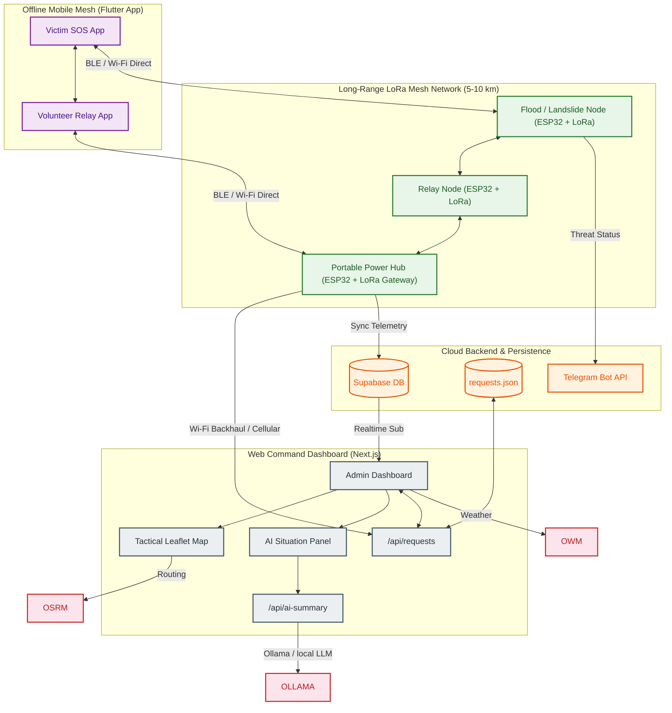

# 📡 ResQLink — Complete System Architecture & Workflow Document

> **Last Updated**: June 2026 | **Version**: 5.0 (Hybrid Mesh & Power Hub Update)
> A unified reference covering every module, technology, protocol, and data pipeline in the ResQLink disaster response platform.

---

## 🗺️ 1. Full-Stack Hybrid Architecture



---

## 🛠️ 2. Complete Technology Stack

### Tier 1 — IoT Sensor Nodes & Portable Hubs
*   **Microcontrollers:** ESP32 DevKit V1 (Main processing, BLE, and Wi-Fi Direct controller).
*   **RF Module:** SX1278 LoRa Transceiver (433MHz / 868MHz sub-GHz long-range radio).
*   **Sensor Suites:**
    *   *Flood:* Parallel Water Line + Ultrasonic Depth Sensor + Rain Gauge.
    *   *Landslide:* MPU6050 (3-Axis Accelerometer/Gyroscope for seismic motion) + Soil Moisture Probe.
*   **Power System:** 50W solar panel, TP4056 / CN3791 MPPT Solar Charger, 20Ah–50Ah Lithium Battery Pack.

### Tier 2 — Mobile Clients (Flutter app)
*   **Ad-hoc P2P API:** Google Nearby Connections (`nearby_connections: 4.3.0`) utilizing BLE for handshake and local Wi-Fi Direct for data sync.
*   **Local Caching:** Hive database (`hive: 2.2.3`).

### Tier 3 & 4 — Command & Control (Next.js Dashboard)
*   **Deployment Options:** Hosted on Vercel/Supabase (Online mode) or locally on an offline Raspberry Pi Zero 2 W acting as a local Wi-Fi AP.
*   **Dashboard Features:** React Leaflet maps, Project OSRM local routing, and locally hosted Gemma model via Ollama for situational summaries.

---

## 🔄 3. Hybrid Mesh Workflow

### 3.1. Unified LoRa Mesh & Sensor Pipeline
1.  **Continuous Monitoring:** Sensor nodes read environmental metrics (soil moisture, acceleration vector, water depth) in ultra-low power mode.
2.  **Edge Diagnostics:** If readings cross danger bounds (e.g., Seismic $>15.0 \, m/s^2$ or flood level $> 2000$), the node wakes up fully.
3.  **LoRa Propagation:** The alert is packed and broadcasted over the LoRa network, hopping node-to-node until it reaches the Gateway at Command HQ.
4.  **Local Notifications:** Simultaneously, the node broadcasts its danger state locally via Bluetooth to warn nearby residents.

### 3.2. SOS Multi-Hop Routing Pipeline
1.  **SOS Capture:** A victim launches the offline mobile app and taps "SOS".
2.  **BLE Bridge:** The phone transfers the SOS packet via BLE/Wi-Fi to the nearest **ESP32 LoRa Node**.
3.  **Radio Transport:** The ESP32 node inserts the packet into the **LoRa Mesh**, forwarding it to the Command Center in under 10 seconds.
4.  **Acknowledgment Broadcast:** Once HQ dispatches a rescue team, the acknowledgment flows back through the LoRa mesh to the node, which syncs it to the victim's phone.

---

## 📊 4. Smart Data Priority Routing

To prevent traffic congestion over low-bandwidth LoRa channels, data packets are scheduled by priority classes:

| Class | Priority | Description | Sample Payload | Hysteresis Trigger |
| :--- | :--- | :--- | :--- | :--- |
| **P1** | **Emergency / SOS** | Threat to human life (Medical, trapped victim) | `{"type":"SOS", "lat":12.31, "lng":76.61, "status":"Injured"}` | Immediate broadcast |
| **P2** | **Disaster Alert** | Environmental sensors crossing threat limits | `{"type":"ALERT", "sensor":"Flood", "value":2350}` | Immediately on threshold cross |
| **P3** | **Environmental Logs** | Routine weather, humidity, and battery status | `{"type":"LOG", "temp":24.5, "battery_pct":88.2}` | Scheduled every 30 mins |

---

## ⚡ 5. Emergency Power Management Architecture

Each Portable Emergency Hub and Remote Sensor Node operates on an autonomous power loop:

```text
  [ 50W Solar Panel ]
         │
         ▼
  [ Solar Charge Controller ] ──> [ 20-50Ah Lithium Battery ]
                                           │
         ┌─────────────────────────────────┴────────────────────────────────┐
         ▼                                                                  ▼
 [ 5V DC Regulator ]                                              [ 5V USB Outputs ]
         │                                                                  │
         ▼                                                                  ▼
 [ ESP32 & LoRa Gateway ]                                         [ Emergency Device Charger ]
   (Always active: BLE,                                              (Phones, flashlights, radios)
    Wi-Fi Direct, LoRa Mesh)
```
